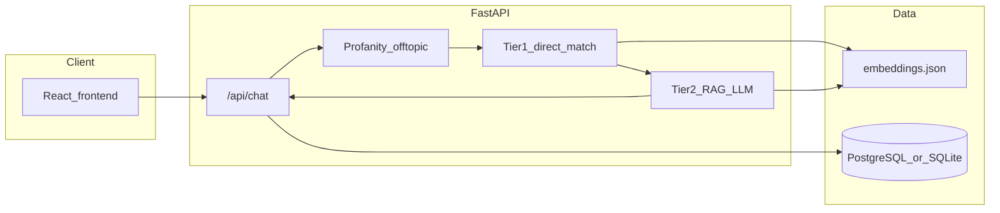

# Folio backend documentation

Canonical technical docs for the Folio API, RAG pipeline, and ops. **Start with the root [README](../../README.md)** for repo-wide quick start.

## Source-of-truth guides

| Topic | File |
| ----- | ---- |
| Local setup, env, embeddings | [SETUP-INSTRUCTIONS.md](SETUP-INSTRUCTIONS.md) |
| Tier 1 / Tier 2 routing and note layout | [TIERED-NOTES-SYSTEM.md](TIERED-NOTES-SYSTEM.md) |
| Prompts and JSON response shape | [PROMPT-DESIGN.md](PROMPT-DESIGN.md) |
| Confidence tiers, profanity, redirects | [CONFIDENCE-THRESHOLD-GUIDE.md](CONFIDENCE-THRESHOLD-GUIDE.md) |
| Profanity filter design | [PROFANITY-FILTER-NOTES.md](PROFANITY-FILTER-NOTES.md) |
| Writing embedding-friendly notes (Tier 2) | [ATOMIC-NOTES-GUIDE.md](ATOMIC-NOTES-GUIDE.md) |
| Analytics (DB, migrations, testing) | [ANALYTICS-SETUP.md](ANALYTICS-SETUP.md) |
| Railway deployment | [RAILWAY_DEPLOYMENT.md](RAILWAY_DEPLOYMENT.md) |

## Architecture (high level)

Embeddings are computed with OpenAI and stored locally in **`backend/embeddings.json`** (not an external vector DB in the current implementation).

## Archived / historical docs

Older planning write-ups and superseded technical specs are kept with an **`ARCHIVE`** suffix in this same folder. Treat them as historical context only; prefer the table above for current behavior.

Examples: `ATOMIC-NOTES-TECHNICAL-ARCHIVE-*.md`, `PRODUCTION-READINESS-STATUS-ARCHIVE.md`, `BACKEND-TODOS-ARCHIVE.md`, `CONFIDENCE-THRESHOLD-PLAN-ARCHIVE.md`, gap/questionnaire expansion plans, and `ANALYTICS-FEATURE-SUMMARY-ARCHIVE.md`.

## Contributing to notes

1. Follow [ATOMIC-NOTES-GUIDE.md](ATOMIC-NOTES-GUIDE.md) for Tier 2 atomic notes.
2. Tier 1 files live under `backend/notes/tier-1-direct-answers/` — see [TIERED-NOTES-SYSTEM.md](TIERED-NOTES-SYSTEM.md).
3. Re-run `embed_direct_answers.py` and/or `embed_notes.py` after substantive edits.
